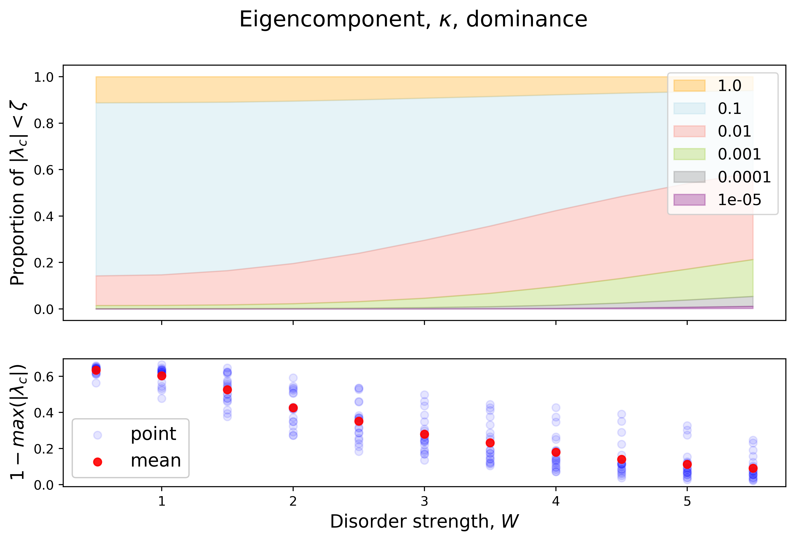

# Many-body Localization - Intrinsic Dimension

We investigate the intrinsic dimension across the many-body localization transition as a means of identification. We obtain intrinsic dimension via 2NN, a neighbour graphs algorithm. Using scaling collapse we are able to determine the critical parameter value.

See IDMBL.ipynb for code along (this can be run on a laptop)

For best experience; clone repo.

